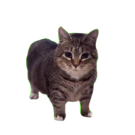
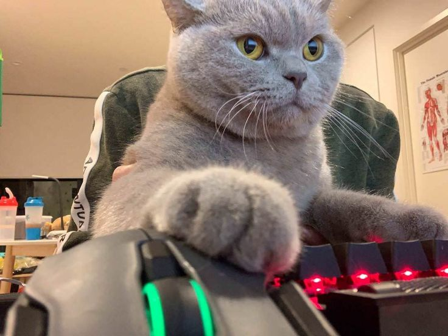

  
  
  

<h1 align="center">Привет  меня зовут Никита!</h1>

###

<h2 style="font-family: Calibri;"> Обо мне</h2>

Я Frontend-разработчик. 

<h3 align="left"></h3>

<h2 align="center">Текущие проекты в разработке</h2>

    
    
    

###

    <h2 style="font-family: Calibri;"> Стек</h2>

  
  
  
  
  
  
  
  
  
  
  
  
  
  
  
  
  
  
  
  
  
  
  
  
  

<h3 align="left"></h3>

###

  

  

###

  

